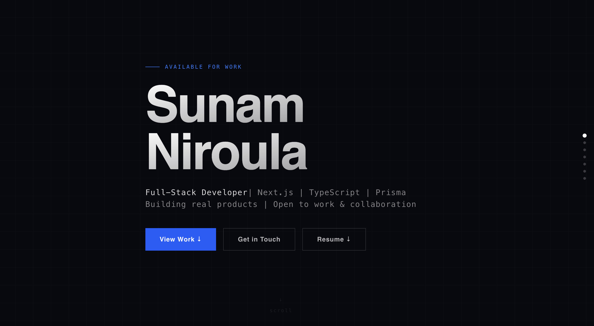
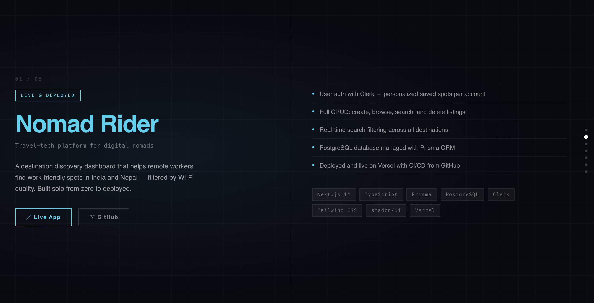
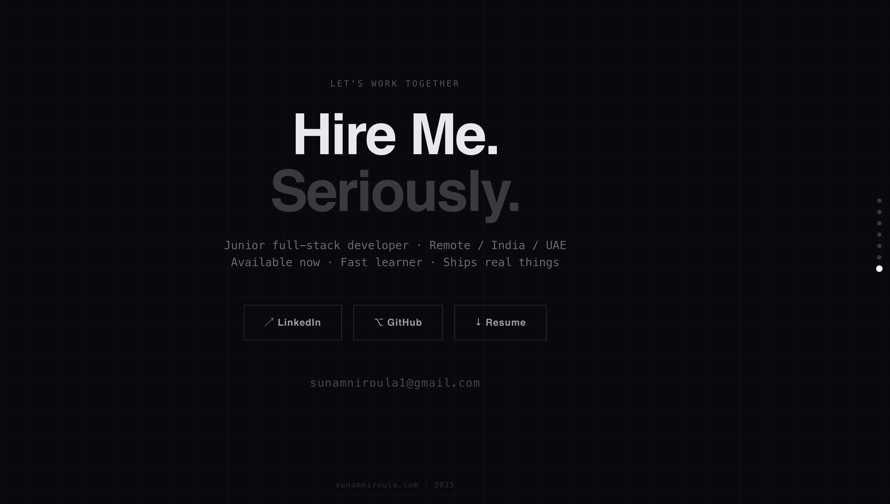

# Sunam Niroula — Developer Portfolio

Personal portfolio site built with Next.js 14, TypeScript, and Tailwind CSS.
Live at [sunamniroula.com](https://sunamniroula.com)

## Screenshots





## Tech Stack

- **Framework:** Next.js 14
- **Language:** TypeScript
- **Styling:** Tailwind CSS v4
- **Fonts:** Syne, DM Mono
- **Deployment:** Vercel

## Features

- Fullpage snap scroll with custom scroll engine — no library
- Keyboard and touch/swipe navigation
- Per-project accent colors
- Responsive for mobile and desktop

## Running Locally
```bash
git clone https://github.com/NiroulaSunam/my-portfolio
cd my-portfolio
npm install
npm run dev
```

Open [localhost:3000](http://localhost:3000)
